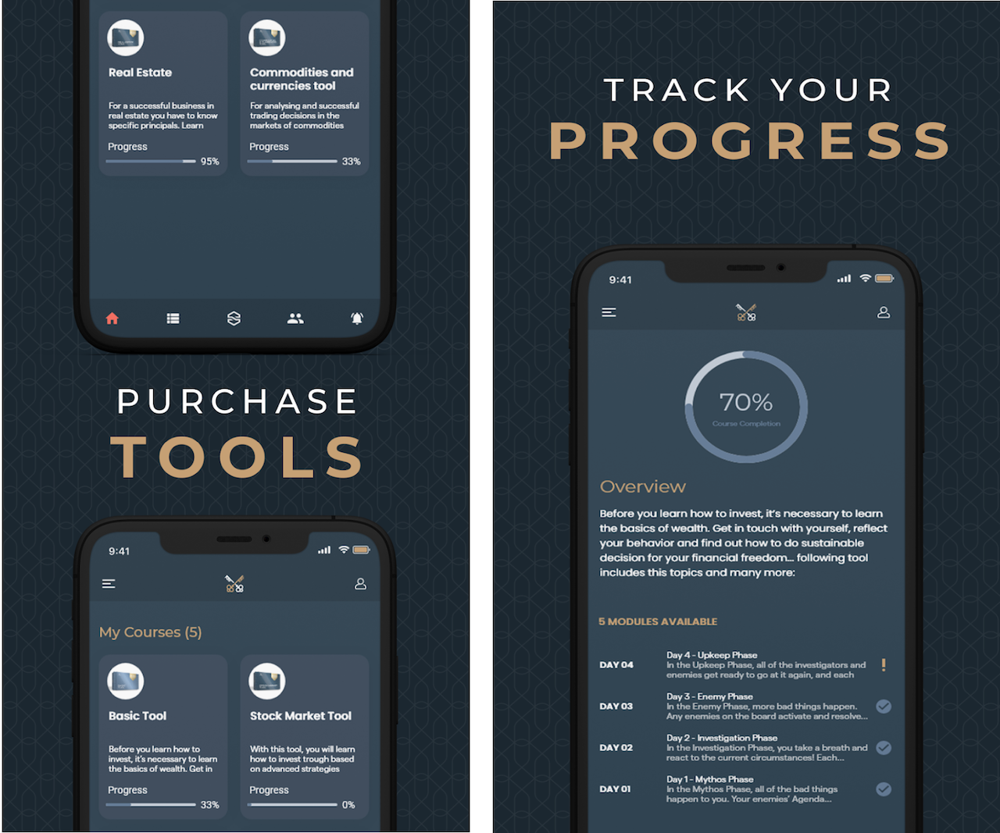

# App Portfolio

Welcome to my portfolio! Here you'll find information about my projects and experience.

## [Download My Resume](resume.pdf)

## Trucker Path: Truck GPS & Fuel

**Overview:**
- Trucker Path: Truck GPS & Fuel is a comprehensive navigation app designed for truckers. It offers a robust set of features tailored specifically for the trucking industry, including GPS navigation, truck stops, fuel prices, weigh stations, and parking availability.

**Features:**
- GPS navigation optimized for trucks
- Real-time updates on truck stops, fuel prices, and parking availability
- Weigh stations and fuel station locator
- Route planning with truck-specific restrictions

**Technologies Used:**
- Swift, UIKit, Core Location, MapKit, Alamofire, Firebase, RESTful

**Primary Role:**
- Developed and maintained various features, including real-time updates on truck stops, fuel prices, and parking availability. Implemented GPS navigation optimized for trucks and integrated Core Location and MapKit for route planning.

**App Store Link:**
- [Trucker Path: Truck GPS & Fuel on the App Store](https://apps.apple.com/ph/app/trucker-path-truck-gps-fuel/id782746890)

## Trucker Path: Load Board

**Overview:**
- Trucker Path: Load Board is a platform that connects truckers with available loads, helping them find the most profitable routes and loads. It streamlines the process of finding and booking loads, providing truckers with essential tools to optimize their operations.

**Features:**
- Search and book loads in real-time
- Load recommendations based on location and preferences
- Integrated messaging with shippers and brokers
- Financial tools to manage earnings and expenses

**Technologies Used:**
- Swift, UIKit, Alamofire, Firebase, Core Data, RESTful

**Primary Role:**
- Developed key features such as real-time load search and booking, integrated messaging, and financial management tools. Worked on enhancing the user interface and improving overall app performance.

**App Store Link:**
- [Trucker Path: Load Board on the App Store](https://apps.apple.com/ph/app/trucker-path-load-board/id1007287939)

## Swapoo Wallet

**Features:**
- Able to hold cryptocurrency
- KYC feature
- Purchase and transfer to another wallet
- Has internal trading bot feature

**Technologies Used:**
- Swift, UIKit, Alamofire, Fastlane for app delivery, Python, AWS (Lambda, SQS, SNS), RESTful

**Primary Role:**
- Developed the app entirely on my own and managed the delivery to the App Store. Later led a team to implement additional features like a trading bot and KYC functionality. Also participated in developing the APIs of this app.

**App Store Link:**
- Already pulled out from the app store.

## Laetitude

**Features:**
- Provides knowledge through learning courses on financial basics and trading, combined with digital tools.

**Technologies Used:**
- Swift, UIKit, RxSwift, Fastlane for app delivery, Alamofire, Python, AWS, RESTful

**Primary Role:**
- Built this app from scratch and managed the delivery to the App Store.

**App Store Link:**
- Already pulled out from the app store.

## IKON Pass

**Features:**
- Track stats like vertical, run difficulty, max speed, and current altitude
- View weather and condition reports
- Find your location on the destination map
- Keep track of exclusive deals and vouchers

**Technologies Used:**
- Swift, UIKit, ReactiveSwift, Combine, Maps, Core Data, Bitrise for CI/CD, RESTful

**Primary Role:**
- Developed new features like offline caching for low connectivity, displaying access days for specific mountains, voucher sharing, API request retry mechanism, and new UI revamp.

**App Store Link:**
- [IKON Pass on the App Store](https://apps.apple.com/us/app/ikon-pass/id1482191120)

## CAPTOR

**Features:**
- Secure content capture
- Photo annotation and editing
- Customize metadata and captions
- Document scanning

**Technologies Used:**
- Swift, UIKit, RealmDB, Cocoapods, AVFoundation, AudioKit, VisionKit, PromiseKit

**Primary Role:**
- Part of the development team that developed the main features of the app.

**App Store Link:**
- [Enterprise App](https://www.inkscreen.com/appconfig)

## Masarap

**Features:**
- Connect with Facebook and Twitter
- Search and reserve restaurant table
- Share reviews on Facebook and Twitter
- Avail restaurant vouchers

**Technologies Used:**
- Swift, Objective-C, UIKit, Core Data, Jenkins for CI/CD, Google Maps, RESTful

**Primary Role:**
- Part of the development team until the initial release of the app. Developed features like login with Facebook, share to Twitter, UI implementation, and restaurant display on maps.

**App Store Link:**
- Already pulled out from the app store.

## docHugo

**Features:**
- Connect your HMO
- Book an appointment with the clinic
- Request letter of authorization

**Technologies Used:**
- Swift, UIKit, Google Maps, RESTful

**Primary Role:**
- Built the app from scratch and managed the delivery to the App Store. Communicated directly with the CTO for deliverables and feature planning.

**App Store Link:**
- Already pulled out from the app store.

## Trucker Path: Truck GPS & Fuel

**Overview:**
- Trucker Path: Truck GPS & Fuel is a comprehensive navigation app designed for truckers. It offers a robust set of features tailored specifically for the trucking industry, including GPS navigation, truck stops, fuel prices, weigh stations, and parking availability.

**Features:**
- GPS navigation optimized for trucks
- Real-time updates on truck stops, fuel prices, and parking availability
- Weigh stations and fuel station locator
- Route planning with truck-specific restrictions

**Technologies Used:**
- Swift, UIKit, Core Location, MapKit, Alamofire, Firebase, RESTful

**Primary Role:**
- Developed and maintained various features, including real-time updates on truck stops, fuel prices, and parking availability. Implemented GPS navigation optimized for trucks and integrated Core Location and MapKit for route planning.

**App Store Link:**
- [Trucker Path: Truck GPS & Fuel on the App Store](https://apps.apple.com/ph/app/trucker-path-truck-gps-fuel/id782746890)

## Trucker Path: Load Board

**Overview:**
- Trucker Path: Load Board is a platform that connects truckers with available loads, helping them find the most profitable routes and loads. It streamlines the process of finding and booking loads, providing truckers with essential tools to optimize their operations.

**Features:**
- Search and book loads in real-time
- Load recommendations based on location and preferences
- Integrated messaging with shippers and brokers
- Financial tools to manage earnings and expenses

**Technologies Used:**
- Swift, UIKit, Alamofire, Firebase, Core Data, RESTful

**Primary Role:**
- Developed key features such as real-time load search and booking, integrated messaging, and financial management tools. Worked on enhancing the user interface and improving overall app performance.

**App Store Link:**
- [Trucker Path: Load Board on the App Store](https://apps.apple.com/ph/app/trucker-path-load-board/id1007287939)# App Portfolio

Welcome to my portfolio! Here you'll find information about my projects and experience.

## [Download My Resume](resume.pdf)

## Swapoo Wallet

**Features:**
- Able to hold cryptocurrency
- KYC feature
- Purchase and transfer to another wallet
- Has internal trading bot feature

**Technologies Used:**
- Swift, UIKit, Alamofire, Fastlane for app delivery, Python, AWS (Lambda, SQS, SNS), RESTful

**Primary Role:**
- Developed the app entirely on my own and managed the delivery to the App Store. Later led a team to implement additional features like a trading bot and KYC functionality. Also participated in developing the APIs of this app.

**App Store Link:**
- Already pulled out from the app store.

## Laetitude

**Features:**
- Provides knowledge through learning courses on financial basics and trading, combined with digital tools.

**Technologies Used:**
- Swift, UIKit, RxSwift, Fastlane for app delivery, Alamofire, Python, AWS, RESTful

**Primary Role:**
- Built this app from scratch and managed the delivery to the App Store.

**App Store Link:**
- Already pulled out from the app store.

## IKON Pass

**Features:**
- Track stats like vertical, run difficulty, max speed, and current altitude
- View weather and condition reports
- Find your location on the destination map
- Keep track of exclusive deals and vouchers

**Technologies Used:**
- Swift, UIKit, ReactiveSwift, Combine, Maps, Core Data, Bitrise for CI/CD, RESTful

**Primary Role:**
- Developed new features like offline caching for low connectivity, displaying access days for specific mountains, voucher sharing, API request retry mechanism, and new UI revamp.

**App Store Link:**
- [IKON Pass on the App Store](https://apps.apple.com/us/app/ikon-pass/id1482191120)

## CAPTOR

**Features:**
- Secure content capture
- Photo annotation and editing
- Customize metadata and captions
- Document scanning

**Technologies Used:**
- Swift, UIKit, RealmDB, Cocoapods, AVFoundation, AudioKit, VisionKit, PromiseKit

**Primary Role:**
- Part of the development team that developed the main features of the app.

**App Store Link:**
- [Enterprise App](https://www.inkscreen.com/appconfig)

## Masarap

**Features:**
- Connect with Facebook and Twitter
- Search and reserve restaurant table
- Share reviews on Facebook and Twitter
- Avail restaurant vouchers

**Technologies Used:**
- Swift, Objective-C, UIKit, Core Data, Jenkins for CI/CD, Google Maps, RESTful

**Primary Role:**
- Part of the development team until the initial release of the app. Developed features like login with Facebook, share to Twitter, UI implementation, and restaurant display on maps.

**App Store Link:**
- Already pulled out from the app store.

## docHugo

**Features:**
- Connect your HMO
- Book an appointment with the clinic
- Request letter of authorization

**Technologies Used:**
- Swift, UIKit, Google Maps, RESTful

**Primary Role:**
- Built the app from scratch and managed the delivery to the App Store. Communicated directly with the CTO for deliverables and feature planning.

**App Store Link:**
- Already pulled out from the app store.
